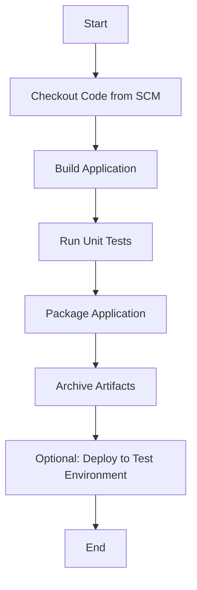
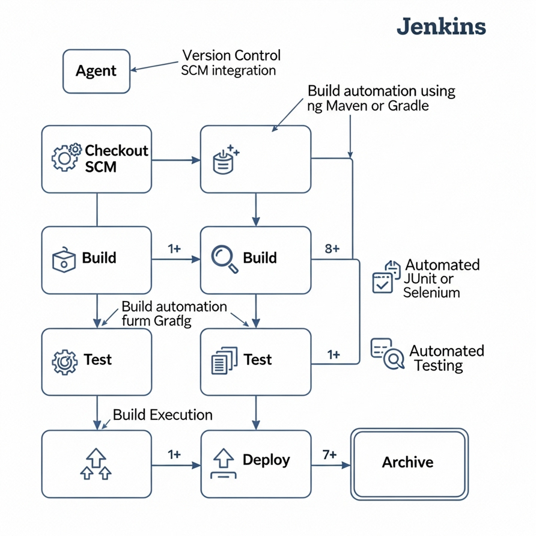

# Jenkins Pipeline for Spring Boot Application

This repository explains the **Jenkins Pipeline** with a simple visual diagram and provides a basic `Jenkinsfile` to **build and test a Spring Boot application**. No real Jenkins setup is required—this is intended for learning and understanding purposes.

---

## 🔧 What is a Jenkins Pipeline?

A **Jenkins Pipeline** is a suite of plugins that supports implementing and integrating continuous delivery pipelines into Jenkins.

A pipeline defines the entire lifecycle of your CI/CD process as code. You write this code in a `Jenkinsfile` that lives in your source code repository.

---

## 📊 Jenkins Pipeline Flow Diagram

##  Demo Jenkins Architecture

