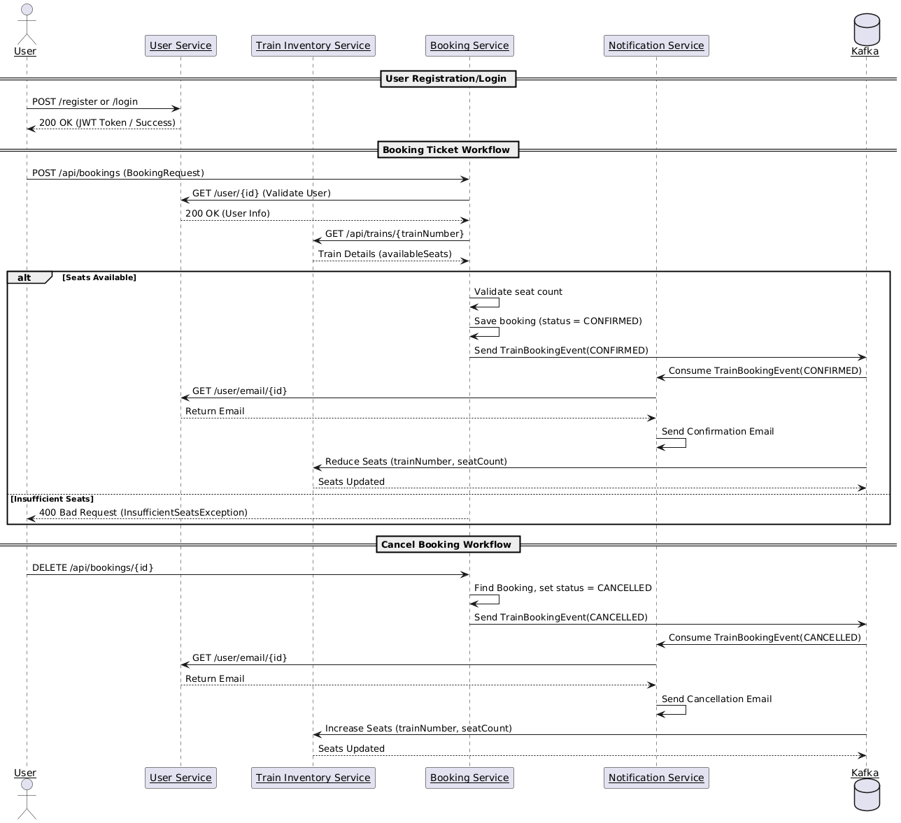
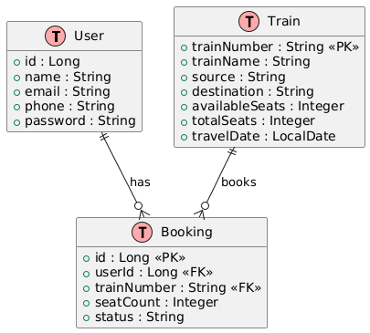

# 🚄 Train Booking Microservices System

This project is a distributed microservices-based system for managing train bookings. It allows users to search for trains, book or cancel tickets, and get notified via email. The system handles train inventory updates automatically through Kafka-based event-driven communication.

---

## 🧩 Microservices Overview

### 1. **User Service**
- Registers and authenticates users.
- Provides user profile and email information for other services.

### 2. **Train Inventory Service**
- Manages train schedules, seats, and availability.
- Supports uploading train data via CSV or Excel files.
- Updates seat counts based on booking events from Kafka.

### 3. **Booking Service**
- Books or cancels tickets.
- Checks available seats before confirming.
- Publishes booking events (`CONFIRMED`, `CANCELLED`) to Kafka.

### 4. **Notification Service**
- Listens to booking events from Kafka.
- Sends email confirmations or cancellations to users.

---

## 📚 Tech Stack

| Layer              | Technology                 |
|-------------------|----------------------------|
| Backend Services  | Spring Boot                |
| Communication     | REST, Kafka                |
| Auth              | JWT (optional)             |
| Data Persistence  | PostgresSQL                |
| Messaging Queue   | Apache Kafka               |
| File Handling     | Apache POI, BufferedReader |
| Testing           | JUnit, Mockito             |
| Build Tool        | Maven                      |

---

## 📌 Key Features

- 📦 Upload train data (CSV, Excel)
- 🔍 Search trains by source/destination/date
- ✅ Confirm booking if seats are available
- ❌ Cancel booking and free up seats
- 📩 Automatic email notifications
- 🔄 Real-time seat updates via Kafka
- 🧪 Fully tested services with unit tests

---

## 📁 Project Structure
   ```bash
      train-booking-system/
      │
      ├── booking-service/
      │ ├── controller/
      │ ├── service/
      │ ├── model/
      │ └── repository/
      │
      ├── train-inventory-service/
      │ ├── controller/
      │ ├── service/
      │ └── repository/
      │
      ├── user-service/
      │ ├── controller/
      │ └── service/
      │
      ├── notification-service/
      │ └── listener/
        
   ```
---
## Workflow Diagram


---
## ER Diagram


---

## 🔄 Kafka Event Workflow

1. **BookingService** → Publishes `TrainBookingEvent` after confirm/cancel.
2. **NotificationService** → Listens to event → Fetches user email → Sends mail.
3. **TrainInventoryService** → Listens to event → Updates available seats.

---

## 🚀 Getting Started

### ✅ Prerequisites

- Java 17+
- Maven
- Docker (for Kafka)
- PostgresSQL

### 🔧 Setup Steps

1. **Clone Repo**
   ```bash
   git clone https://github.com/your-username/train-booking-system.git
   cd train-booking-system

2. **Start Kafka and Zookeeper**
3. **Configure PostgresSQL DBs**
4. **Run Services**
    ```bash
   cd booking-service
   mvn spring-boot:run

    cd ../train-inventory-service
    mvn spring-boot:run

    cd ../user-service
    mvn spring-boot:run

    cd ../notification-service
    mvn spring-boot:run

5. **🔬 Testing**
   Each service includes JUnit and Mockito-based test coverage.

Run tests with:

```bash

mvn test